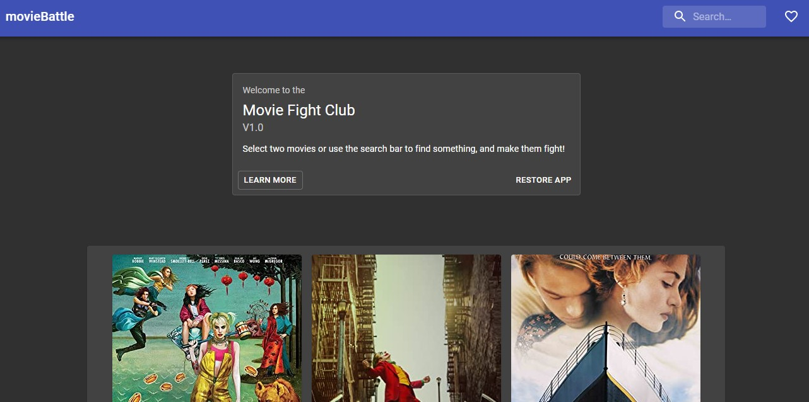

# React Movie Battle App

> React Movie App v1.0 build with Material-UI, Hooks && React-Router

# Live demo

> https://cranky-thompson-24c649.netlify.app/



## Table of contents

- [General info](#general-info)
- [Next](#next)
- [Setup](#setup)
- [Code Examples](#code-examples)
- [Features](#features)
- [Status](#status)
- [Contact](#contact)

## General info

Following my training, I decided to develop an app that I could add everything I know about React, I decided to not use Redux because I didn't want to be the "Redux for all guy" and I also wanted to dive down into useState and useContext, and after all, it has been a great mistake.

I consider this app my most advanced React app, yet, the most junior app because of the lack of comments and organization, and that has taught me how to do it better on my following projects.

## Next

Now I'm working on V2.0 which will use modern and clean Redux

## Code Examples

./src/contexts/movie.context.js

```
import React, { useState, createContext, useEffect } from 'react';
import { fetchInitialVal } from '../api/api';
import useInput from '../hooks/useInput';
import useLocalStorage from '../hooks/useLocalStorage';

export const MovieContext = createContext();

export function MovieProvider(props) {
  const [val, handleVal, restoreVal] = useLocalStorage('movies');
  const [currentMovieList, setCurrentMovieList] = useState('');
  const [initialVal, setInitialVal] = useState([]);
  const [primaryMovie, setPrimaryMovie] = useState('');
  const [secondaryMovie, setSecondaryMovie] = useState('');
  const [input, handleChange, reset] = useInput();
  const [loading, setLoading] = useState(false);

  useEffect(() => {
    const fetchInitalValHandler = async () => {
      setLoading(true);
      const initialValues = await fetchInitialVal();

      setInitialVal(initialValues.map((val) => ({ ...val, liked: false })));
      setLoading(false);
    };
    val === 'movies' ? fetchInitalValHandler() : setInitialVal(val);
  }, [val]);

  useEffect(() => {
    setCurrentMovieList(initialVal);
  }, [initialVal, setCurrentMovieList]);

  useEffect(() => {
    handleVal(currentMovieList);
  }, [currentMovieList, handleVal]);

  return (
    <MovieContext.Provider
      value={{
        currentMovieList,
        setCurrentMovieList,
        setPrimaryMovie,
        primaryMovie,
        setSecondaryMovie,
        secondaryMovie,
        input,
        handleChange,
        reset,
        restoreVal,
        loading,
      }}
    >
      {props.children}
    </MovieContext.Provider>
  );
}
```

## Features

The project is created with:

- React
- Hooks && Custom Hooks (useLocalStorage and useInputForm).
- Material UI
- React Router

## Setup

### `npm install & npm start`

Runs the app in the development mode.\
Open [http://localhost:3000](http://localhost:3000) to view it in the browser.

The page will reload if you make edits.\
You will also see any lint errors in the console.

## Status

Finished, but, refactor to redux in curse

## Contact

Created by Cudi - feel free to contact me!
